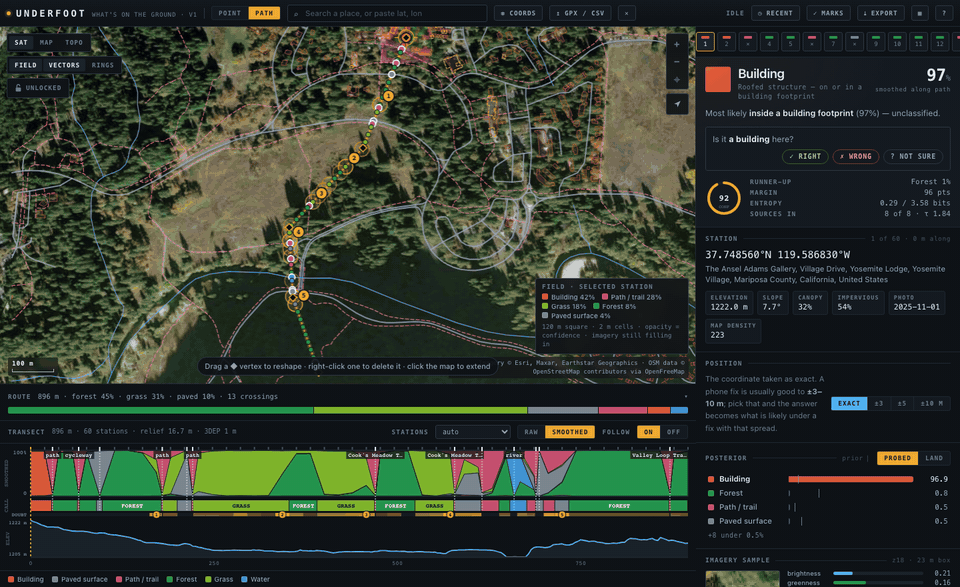
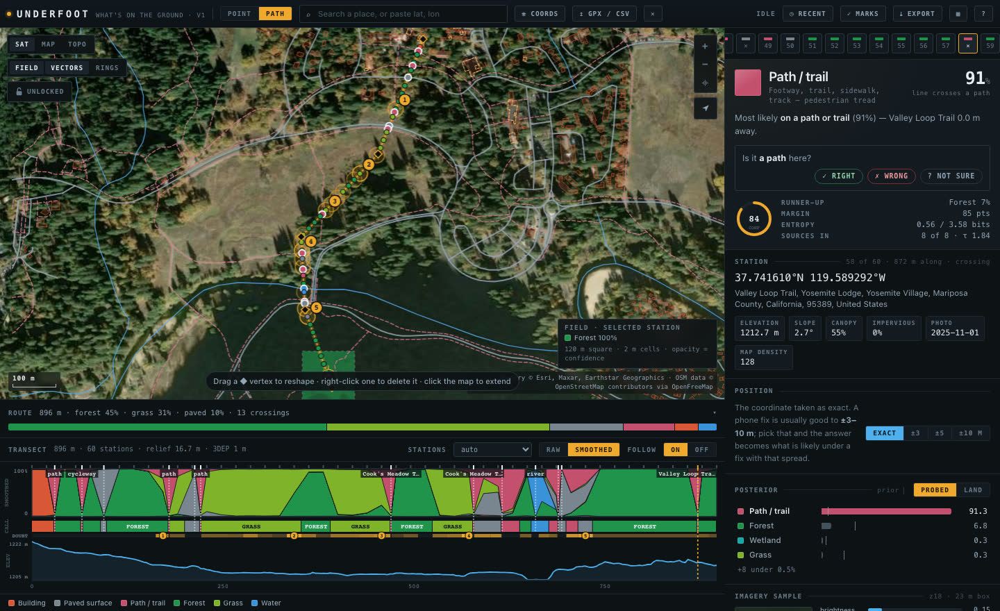
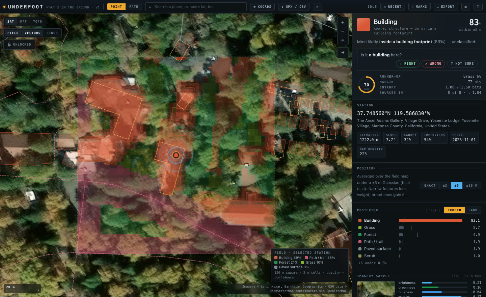
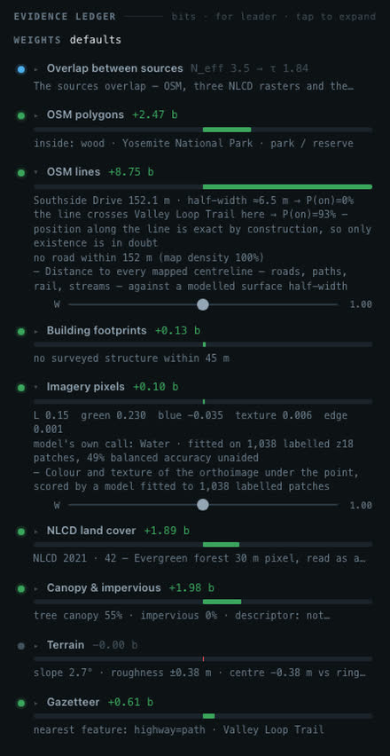
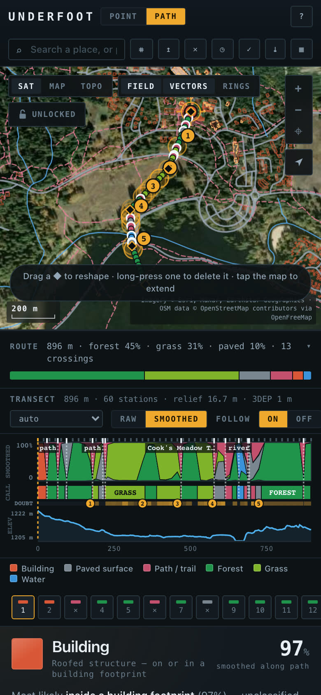
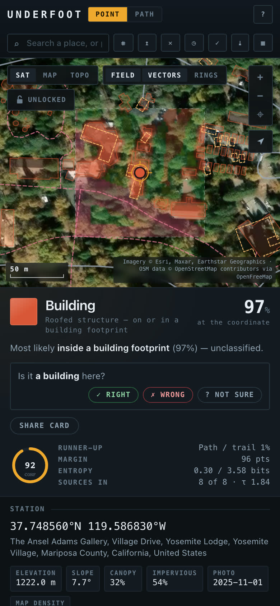
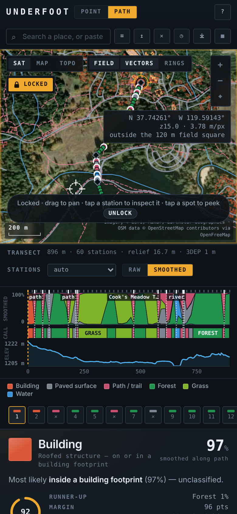
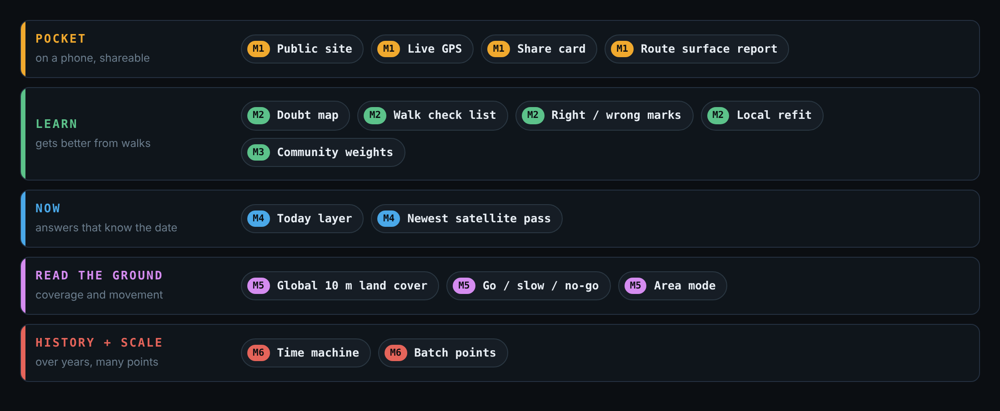

# Underfoot

**What's physically on the ground at a GPS point, or all along a path.** Road, trail, forest, lawn, building, water, wetland, rail, crops, bare ground or snow: Underfoot fuses ten free open-data sources, today's weather and the newest satellite pass among them, and returns a probability for each, with its working shown.

[](https://github.com/dogum/underfoot/actions/workflows/ci.yml)
[](https://dogum.github.io/underfoot/)
[](https://github.com/dogum/underfoot/releases/latest)
[](LICENSE)

**[Open the app](https://dogum.github.io/underfoot/)** · [Download `underfoot.html`](https://github.com/dogum/underfoot/releases/latest) · [How it works](docs/method.md) · [Roadmap](docs/roadmap.md) · [Changelog](CHANGELOG.md)



<sub>A 900 m line across Yosemite Valley: from the Ansel Adams Gallery over two roads, through Cook's Meadow, across the Merced River and into the forest to the Valley Loop Trail. Each point along it is a *sounding*.</sub>

No API keys, no account, no server. It runs in your browser, on a phone, or from a single HTML file on disk.

## One line, every crossing

Draw a line, paste coordinates, or drop in a GPX, CSV or GeoJSON track. Stations are spaced along it, and every mapped road, trail, rail line and stream the line crosses gets a station of its own, named from OpenStreetMap. Where the line follows a mapped trail or road, its stations move onto it and read as what it is, and a GPS track's weave across the trail it's on doesn't count as crossings. The transect underneath shows the posterior along the whole line over its elevation profile, and a route card above it sums the line up: how much of it is forest, grass, path or road, what it crosses, how much it climbs, and which stations it's unsure about. A station worth checking on the ground, because the call is close or the sources disagree, gets an amber halo on the map and a mark on the transect's doubt band, and the answer says why: *grass 49% or forest 48% · the map says grass, land cover says forest*. The five most worth a look, 40 m or more apart, make a numbered **check list** for your next walk, which exports as GPX waypoints.

**Right or wrong.** Under any answer, say whether it's right, wrong or you're not sure, what's really there and how you know. A mark keeps what each source said at that moment and stays in your browser; the Marks menu lists, edits and exports them. With ten or more, **Refit** fits the source weights to your marks, shows how many each set gets right on marks it never saw, and lets you choose; Reset puts the defaults back exactly.



On the demo line, the gallery comes out **building 97%**, Northside and Southside Drives **paved 98%**, Cook's Meadow **grass** at up to 98%, the Merced River **water 98%**, and the Valley Loop Trail, under 55% tree canopy in an evergreen-forest pixel, **path 91%**. Smoothing along the line cleans up one-station flicker inside a run of forest or meadow but never blurs a road, building or crossing.

## A point, with the uncertainty you actually have

Phone fixes wander 3–10 m. Choose ±3, ±5 or ±10 m and the answer becomes the 2 m field map averaged under that disc, which is what a fix actually tells you.



At the Ansel Adams Gallery the exact coordinate says building (97%). At ±3 m it's 94%, at ±5 m 83%, and at ±10 m it spreads to 56% building, with the forest and grass around it taking most of the rest.

## Every source on the table



The ledger shows what each source said, how many bits it moved the answer, and its reasoning in plain words. At the trail crossing: *the line crosses Valley Loop Trail here → P(on)=93%*, *NLCD 2021 · 42 — Evergreen forest*, *tree canopy 55%*, *no surveyed structure within 45 m*.

Every weight has a slider, and so does the correlation discount, so you can disagree with a source and watch the answer move.

When a call looks wrong, **Export → Report a wrong call** opens a GitHub issue with the sounding linked. Each report becomes a test case, and later training data.

<br clear="right">

## In your pocket

<p>



</p>

Tap to probe, tap to draw a line with Undo and Done, drag a vertex to reshape it, long-press to delete one, pinch to zoom. **Lock** freezes a finished sounding so stray taps only pan, zoom, pick stations and peek at the field map.

**Here** follows your phone and reads the ground under you as you walk. The newest fix is read together with the last 200 m of fixes behind it, so on a trail it names the trail, even when the fix itself is 15 m off in the trees. It re-reads only when you've moved farther than the fix's own accuracy. **Rec** keeps the walk; Stop reads it as a line you can export or share.

**Share card** (Export, or the button under the answer on a phone) makes one picture of the call: the map, the answer and its runners-up or a line's share of length, the place and date, and the link that reopens it. 1200 × 630, about 150 KB. A phone hands it to the share sheet.

## Try these

| Place | Underfoot says |
|---|---|
| [The demo line, Yosemite Valley](https://dogum.github.io/underfoot/#m=path&s=auto&v=37.748560,-119.586830;37.746200,-119.588000;37.744500,-119.590000;37.743000,-119.589900;37.741400,-119.589200) | building → roads → meadow → river → forest, with every crossing named |
| [The Ansel Adams Gallery, Yosemite](https://dogum.github.io/underfoot/#m=point&s=auto&v=37.748560,-119.586830) | building 97% |
| [Half Dome summit](https://dogum.github.io/underfoot/#m=point&s=auto&v=37.745950,-119.533150) | bare ground 93% |
| [Grand Prismatic Spring, Yellowstone](https://dogum.github.io/underfoot/#m=point&s=auto&v=44.525100,-110.838200) | water 97% |
| [Paradise snowfield, Mount Rainier](https://dogum.github.io/underfoot/#m=point&s=auto&v=46.852000,-121.740000) | snow / ice 70%, bare next |
| [Angels Landing summit, Zion](https://dogum.github.io/underfoot/#m=point&s=auto&v=37.269350,-112.947650) | bare ground 55%, scrub next |
| [The Everglades](https://dogum.github.io/underfoot/#m=point&s=auto&v=25.500000,-80.800000) | wetland 64%, water next |
| [Lake Louise, Banff](https://dogum.github.io/underfoot/#m=point&s=auto&v=51.417000,-116.221000) | water 98% |

<sub>Calls as of October 2026; they shift a little as OpenStreetMap and the imagery are updated. Ten park trails to load as GPX are in [`tests/fixtures/trails`](tests/fixtures/trails/).</sub>

## How it works

Each source turns what it sees into a log-likelihood over the twelve classes. They're added in log-odds space to a prior and normalised.

| Source | What it reads | Coverage |
|---|---|---|
| OSM polygons | buildings, water, woods, farmland, parks and land use enclosing the point ([OpenFreeMap](https://openfreemap.org) vector tiles) | global |
| OSM lines | distance to every road, path, rail and stream centreline against a modelled half-width | global |
| Building footprints | [FEMA USA Structures](https://gis-fema.hub.arcgis.com/pages/usa-structures): footprint, occupancy, height | US |
| Imagery pixels | colour and texture of [Esri World Imagery](https://www.arcgis.com/home/item.html?id=10df2279f9684e4a9f6a7f08febac2a9) under the point, scored by a classifier fitted to 1,038 labelled patches | global |
| Land cover | [NLCD 2021](https://www.mrlc.gov/) 30 m class, read as a mixture | CONUS |
| Canopy and impervious | NLCD tree-canopy and impervious fractions, plus the descriptor that tells road from roof | CONUS |
| Terrain | slope, roughness and relief from [USGS 3DEP](https://www.usgs.gov/3d-elevation-program) in the US (1 m lidar where it has been flown, a 3 m or 10 m DEM otherwise), or a ~90 m DEM via [Open-Meteo](https://open-meteo.com) elsewhere | global |
| Gazetteer | [Nominatim](https://nominatim.org) reverse geocode, counted only when its polygon contains the point | global |
| Today | the [Open-Meteo](https://open-meteo.com) weather model at the point: snow depth, soil moisture, recent rain and snowfall. Fresh snow lies on top of the ground; wet soil leans to wetland | global |
| Newest pass | the [Sentinel-2](https://sentinels.copernicus.eu/web/sentinel/missions/sentinel-2) scene class at the 20 m pixel from the newest pass with a clear view, found through [Element 84's Earth Search](https://element84.com/earth-search/) and read in the browser. Fades with age; a cloudy pixel abstains | global |

What keeps it honest:

- **Correlation discount.** OSM, the NLCD rasters and the photo partly see the same trees, so the summed evidence is divided by τ = (active weight) / N_eff, with N_eff ≈ 3.5. Abroad, where three sources go dark, τ falls on its own.
- **Sub-pixel floor.** A 2 m trail inside a forest polygon, under canopy, inside a forest pixel would be voted out by sources that can't resolve it. Area-scale sources may support a narrow class but not refute it, and only where something has seen that class nearby.
- **Crossings are facts.** Where a line crosses a mapped road, the road's probability comes from its existence odds directly, outside the discount.
- **Nothing reads 100%.** A 2% uniform mixture stands for "any source can be wrong".

The full method is in [docs/method.md](docs/method.md).

## How good it is

On 25 spots labelled by eye before running, **22 are called correctly** and 23 have the truth in the top two. All 19 US spots are right; abroad it's 3 of 6. On 18 engine fixtures, 17 are exact and all 18 are in the top two.

Along ten trails mapped by the National Park Service, from Angels Landing to the Anhinga boardwalk, it calls path at **479 of 480** stations, and at 87–94% along three hikers' GPS tracks of the Mist Trail, which wander 4–8 m off it at the median. A line that runs along a mapped trail is matched to it ([how](docs/method.md#following-a-path-or-road)). Before that, in 1.0.0, it was 8% and 2–7%: it named the forest, scrub or wetland around the trail. A transect drawn beside a trail, or across one, isn't matched; the demo line crosses paths nine times and roads three times, and follows none.

The details, and every miss, are in [docs/validation.md](docs/validation.md).

### Limits

- Outside the contiguous US, three of the ten sources (FEMA footprints and both NLCD layers) have nothing to say, and accuracy drops with them.
- Today's weather is a model on a grid a few kilometres wide, not a measurement. It can carry snow that isn't there: at the Aletsch glacier in October it held 43 cm with none fallen in a week. So snow only lies on top of the ground after recent snowfall, and not at all when a clear satellite pass in the last ten days saw none and none has fallen since.
- Satellite photos can be years old or leaf-off. Seasonal snow over mapped bare rock fooled it at the Aletsch glacier, which it called bare at 97%. It still says bare, but now marks the spot as worth a look: the photo says snow.
- A single point on a trail still reads as the land around the tread; only a line that follows the trail is matched to it. A GPS track 10–15 m beside a trail gets matched too; switch **follow** off on the transect for that.
- OpenStreetMap completeness varies; where the map is thin, absence counts for less.
- The imagery classifier was trained on US scenes.

Read the percentages as calibrated opinion, not measurement.

## Run it yourself

**Offline:** download `underfoot.html` from the [latest release](https://github.com/dogum/underfoot/releases/latest) and open it. It needs a network connection for the data, nothing else.

**From source:**

```bash
npm install
npm run dev          # http://localhost:5173
npm run check        # format, types, unit tests, both builds
npm run e2e          # browser tests: soundings, mouse, touch, lock
npm run trails       # the real-trail validation (docs/validation.md)
npm run spots        # 36 places abroad, labelled from imagery (docs/validation.md)
```

`npm run build` writes the site to `dist/` (deployed to GitHub Pages from `main`) and the offline file to `dist-single/underfoot.html` (attached to each release). In the browser console, `underfoot` exposes the state, the engine and the parsers.

## Repository layout

```
src/
  core/         classes, priors, math, geometry, DOM helpers, shared types
  data/         one module per external source, plus the vector-tile decoder
  engine/       geometry, evidence, fusion, field map, smoothing, path following, doubt, narration (pure)
  app/          state, stations and crossings, the sounding run, user actions
  map/          canvas map, drawing, interaction, lock
  ui/           console, transect, menus, dialogs
  io/           coordinates, files, search, links, history, export, GPX, marks
model/          imagery classifier weights
calib/          how the imagery classifier was fitted (Python)
tests/unit      engine fixtures and parsers (Vitest)
tests/e2e       browser tests (Playwright)
tests/fixtures  ten National Park Service trails as GPX, 36 labelled places abroad
scripts/        README images, trail fixtures, the trail validation, the community refit
supabase/       the community store's table and rules (not switched on yet)
docs/           method, validation, architecture, community weights, roadmap
```

The code is moving to strict TypeScript file by file; `core/`, the fusion engine and path following are done. See [docs/architecture.md](docs/architecture.md).

## Roadmap



Four milestones are out:
- **M1, the phone-first release:** following trails, live GPS, a route surface report and share cards.
- **M2, the learning loop:** mark calls right or wrong and refit the weights in your browser.
- **M3, community weights:** built and switched off until there are walkers to share marks.
- **M4, Now:** today's snow and soil, and the newest satellite pass.

Next is M5, reading the ground better outside the US and saying how passable it is. Each item and what "done" means is in [docs/roadmap.md](docs/roadmap.md).

## Contributing

The most useful thing you can do is report a wrong call: it's one click from the Export menu. Code, data-source ideas and fixes are welcome too; see [CONTRIBUTING.md](CONTRIBUTING.md). Every data source has to be free, keyless and readable from a browser.

## Your marks and privacy

Marks are kept in your browser (IndexedDB) and nowhere else. *Marks ▸ Share* is how they leave it, a batch at a time and only when you choose. The community store isn't switched on yet; until it is, Share saves the batch as a file, exactly as it would be sent. How the store works and how it gets switched on: [docs/community.md](docs/community.md).

| A shared mark carries | It never carries |
| --- | --- |
| what each source said there (10 sources × 12 classes, log-likelihoods to 4 places) | the coordinates, unless you tick *Also share the exact points* (then to about a metre) |
| whether you said right or wrong, what was really there, and Underfoot's call with its probability | the place name |
| how you know (standing here, a photo, the imagery, local knowledge), if you said | the link to the sounding |
| the 1° cell it's in (N37W120 is 37–38°N, 119–120°W) | the day and time |
| the month, the app version and the prior in use | not-sure marks |
| the mark's random id, and a random id for your browser so the fit can count one person as one | |

## Credits and data

The code is MIT-licensed. The data each source returns stays under its provider's terms, and the app credits them on the map.

- Map data © [OpenStreetMap](https://www.openstreetmap.org/copyright) contributors (ODbL), served by [OpenFreeMap](https://openfreemap.org)
- Imagery © Esri, Maxar, Earthstar Geographics and the GIS user community, under [Esri's terms of use](https://www.esri.com/en-us/legal/terms/full-master-agreement)
- USA Structures: FEMA · NLCD: MRLC consortium / USGS · 3DEP: USGS
- Today's weather and the elevation fallback: [Open-Meteo](https://open-meteo.com) (CC BY 4.0; the free tier is for non-commercial use)
- The newest pass: contains modified Copernicus Sentinel data, found through [Element 84's Earth Search](https://element84.com/earth-search/) and read from the Sentinel-2 cloud-optimised GeoTIFFs on AWS Open Data
- Geocoding: [Nominatim](https://nominatim.org) (ODbL data; the app keeps to its one-request-a-second policy)
- Basemaps: Esri Dark Gray Canvas (Esri, HERE, Garmin, © OpenStreetMap contributors), © OpenTopoMap (CC BY-SA)

If you deploy Underfoot commercially, check the Esri and Open-Meteo terms first.

Before its first public release, Underfoot was a single HTML file called SOUNDING. A single probe is still called a sounding.

## License

[MIT](LICENSE) © 2026 dogum
