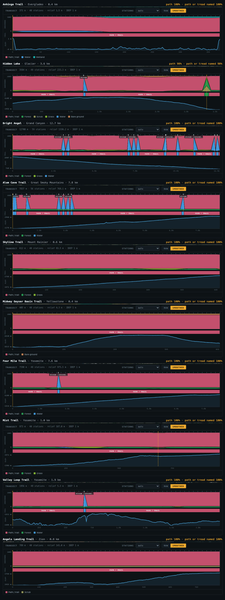
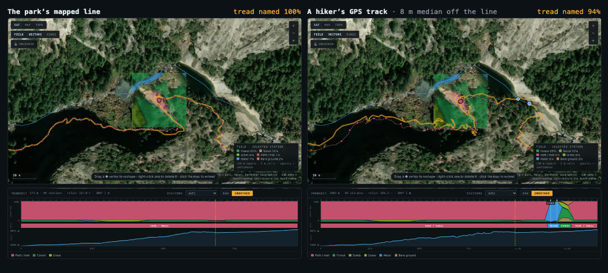

# Validation

## Engine fixtures (`tests/unit/engine.test.ts`)

Eighteen synthetic scenes built from map features in local metres, with the raster, terrain and pixel evidence each source would see: a reservoir, a river centreline, a trail through woods, woods 13 m off that trail, a street, a motorway, inside a footprint, a suburban house under canopy, a park lawn, farmland, a beach, a marsh, a rail line, a tertiary road, a glacier abroad, open sea with and without a coastline polygon, forest abroad.

**17 of 18 called exactly, 18 of 18 in the top two**, no call above 98%. A scene with no evidence at all gives a low-confidence answer (forest 23%, confidence 10%).

## Live spots

25 places labelled by eye from zoom-19 imagery *before* running the engine (`|` marks acceptable alternates).

| Result | Count |
|---|---|
| Correct | **22 / 25** |
| Strict (first label) | 19 / 25 |
| Truth in the top two | 23 / 25 |
| United States (all 8 sources) | 19 / 19 |
| Abroad (4–5 sources) | 3 / 6 |

By stated confidence: ≥70% → 9 of 10 right; 40–70% → 8 of 8; under 40% → 5 of 7.

### The misses

| # | Place | Truth | Call | Why |
|---|---|---|---|---|
| 20 | Seine quay, Paris | paved | water 39% | OSM's river polygon covers the quay; the photo shows stone. Low confidence. |
| 24 | Aletsch glacier edge | snow | bare 97% | OSM maps bare rock; the photo had seasonal snow. The one confident miss. A recent-pass layer (Sentinel-2) would catch it. |
| 22 | Sahara | bare | grass 23% | Bare 16% close behind, confidence 15%: it knew it didn't know. |

## Real trails (`scripts/validate-trails.mjs`)

Ten trails in eight national parks, from the National Park Service's own trail lines ([fixtures](../tests/fixtures/trails/), public domain), each run through the app as a path. The truth at every station is the same: you're on the trail. Crossing stations are left out of the scores, since they say "path" by construction.

A line that runs along a mapped path is matched to it, and its stations are known to be on it ([how](method.md#following-a-path-or-road)). Before that, in 1.0.0, Underfoot called path at 8% of these stations. It named the forest, scrub or wetland each trail runs through, with path usually second.

| Trail | Park | Length | Stations | Followed | Path | Path in 1.0.0 |
| --- | --- | --: | --: | --: | --: | --: |
| Mist Trail | Yosemite | 1.0 km | 48 | 100% | 100% | 7% |
| Valley Loop Trail | Yosemite | 1.9 km | 48 | 100% | 100% | 10% |
| Four Mile Trail | Yosemite | 7.6 km | 48 | 100% | 100% | 2% |
| Angels Landing Trail | Zion | 0.8 km | 48 | 100% | 100% | 0% |
| Bright Angel Trail | Grand Canyon | 12.7 km | 48 | 100% | 100% | 19% |
| Skyline Trail | Mount Rainier | 0.6 km | 48 | 100% | 100% | 27% |
| Midway Geyser Basin boardwalk | Yellowstone | 0.4 km | 48 | 100% | 100% | 9% |
| Anhinga Trail boardwalk | Everglades | 0.4 km | 48 | 100% | 100% | 0% |
| Alum Cave Trail | Great Smoky Mountains | 7.8 km | 48 | 100% | 100% | 0% |
| Hidden Lake Trail | Glacier | 3.6 km | 48 | 98% | 98% | 4% |
| **All ten** | | **37 km** | **480** | | **99.8%** | **8%** |

*Followed* is the share of the line's length matched to a mapped path. The one miss is on Hidden Lake, where the Park Service's line and OpenStreetMap's trail run 24 m apart for about 75 m: the matcher lets go there, and that station reads forest (46%).

### Hikers' GPS tracks

Three public OpenStreetMap GPS traces cover the Mist Trail ([1](https://www.openstreetmap.org/user/okainov/traces/11350011), [2](https://www.openstreetmap.org/user/Alexandr%20Nikitin/traces/3864771), [3](https://www.openstreetmap.org/user/nono303/traces/2902426); © OpenStreetMap contributors). The script fetches them at run time (they're cached locally, not committed) and keeps one pass from the footbridge to Vernal Fall.

| Track | Fixes | Recorded length | Off the park's line (median / 90th pct) | Followed | Path | Path in 1.0.0 |
| --- | --: | --: | --: | --: | --: | --: |
| 1 | 197 | 1.4 km | 7.9 m / 20.8 m | 90% | 94% | 7% |
| 2 | 153 | 2.0 km | 8.4 m / 17.4 m | 87% | 87% | 2% |
| 3 | 182 | 1.1 km | 3.9 m / 17.4 m | 89% | 90% | 2% |

Under the walls of the gorge, phone fixes sit 4–8 m off the trail at the median and 17–21 m at the 90th percentile, and the wander adds 10–94% to the recorded length of a 1.0 km trail. Every miss is in one stretch per track where the fixes run 19–39 m from the mapped trail for 100–260 m. There the matcher lets go, and those stations read as the forest or the river they landed in (on track 1, one is water at 92%).

### Controls

Following has to fire along trails and stay quiet beside them.

| Control | Lines | Followed |
| --- | --: | --: |
| Each trail drawn by hand: cut to the bends a person would click (12–329 vertices), within 4 m of the trail | 10 | 100% |
| Each trail moved 25 m to one side, a transect beside it | 10 | 13% |
| The demo line, which crosses trails and roads and follows none | 1 | 0% |

The 25 m shift is the hard case. On five trails it follows 0–3%. Where it does follow, a mapped path is 6–13 m from the shifted line (median per stretch), so it is following something real: on Four Mile (54%) and Bright Angel (36%) a switchback brings the next leg of the trail within reach, on Skyline (23%), the Mist Trail and Hidden Lake (7–8%) a bend does the same, and at the Bright Angel trailhead the shifted line runs along the Rim Trail.

### Limits

- A recorded line 10–15 m beside a trail is matched to it. A GPS track can't tell "on the trail with a poor fix" from "walking beside it". Switch **follow** off on the transect (it's kept in the link as `f=0`) for a transect that runs beside a trail on purpose.
- A point dropped mid-span on a footbridge can still read the water under it: a 1.6 m tread mapped to ±1.8 m can't outvote a river. A line along the bridge reads the bridge, by following it or, with following off, at the crossing on the deck. (The water stations on the hiker tracks are something else: fixes that wandered over the river where the matcher let go.)

Rerun with `npm run build && npm run trails` (add `-- --shots` to redraw the figures).

## Interaction (`tests/e2e/`)

80 browser checks: a point, the demo line, the Mist Trail and a footbridge with every source live (the route card reconciles with the transect, road crossings count their mapped width, and the share card is a 1200 × 630 JPEG under 400 KB for a point and a line) (the demo line follows nothing; the Mist Trail line follows the Mist Trail, shows what it follows, and the follow switch turns it off and on); mouse and keyboard (panning never moves the probe, drawing, undo, vertex drag and delete, wheel zoom, coordinate formats, file formats, links, export); touch at phone size (all controls on screen, the follow switch and the share button included, the route card folded to one line, menus inside it, Undo/Done, long-press delete, touch pan); the lock; and Here, with emulated geolocation (reading a fix, standing still, walking, a fix too rough to read, a walk up the Mist Trail that names the trail, recording, a link ending it, location turned off).
